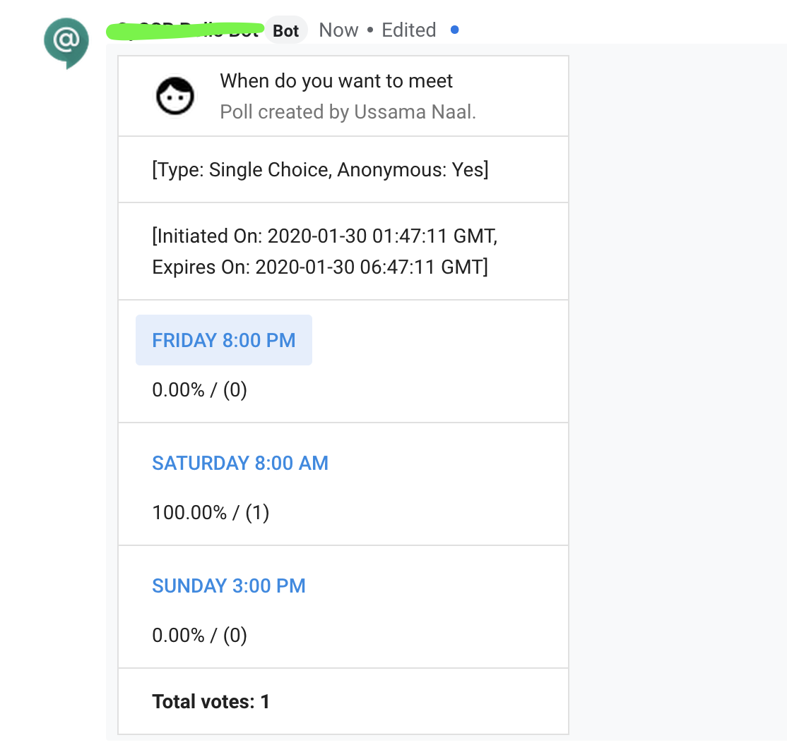

# Hangouts Chat Polls Bot
Builds a custom poll within hangouts chat

# Features
 - Polls can be made single choice per voter or multi choice.
 - Allow votes to be identified or choose the poll to be anonymous.
 - Optionally set an expiration time for the poll.

# Roadmap
Features to come:
 - For time based polls add the ability to show time correctly by the participant time zone.
 - Add the ability for sub responses .. (for example: show YES, NO, Maybe under a given possible response).
 - Add the ability to visually construct the poll (using cards too)

# Configuration
Please refer to https://developers.google.com/hangouts/chat/how-tos/bots-publish on how to add the bot to configure and prepare be your bot for deployment.  
Additioanlly in the code make sure to set the BOT_NAME variable to match the name you picked for your bot during bot configuration step.

# Usage
After you add the bot to a room or a space you may start a new poll by posting a question with choices as follows:  
**When do you want to meet? Friday 8:00 PM, Saturday 8:00 AM, Sunday 3:00 PM.**  
The bot would then ask you few questions about the nature of the poll.  
_Note 1:_ A poll needs to have at least two options!  
_Note 2:_ During poll formation if any of you replies contain the '?' symbol then this would start a new poll!  

Once you finish answering the follow up questions the bot will post the poll into the room and starts counting the votes from different participants as shown below:  

